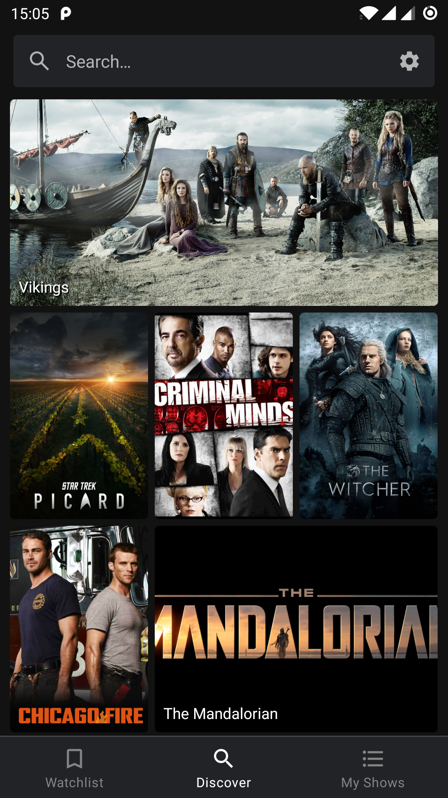
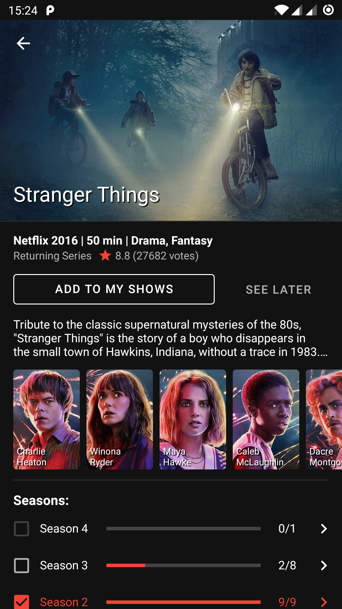
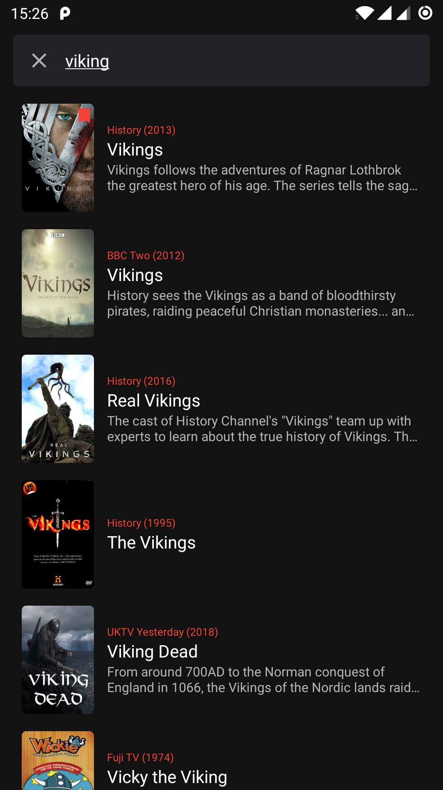
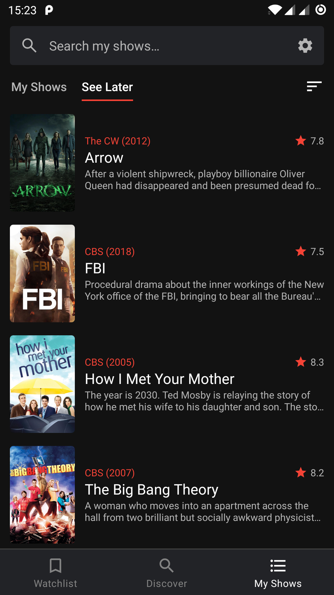
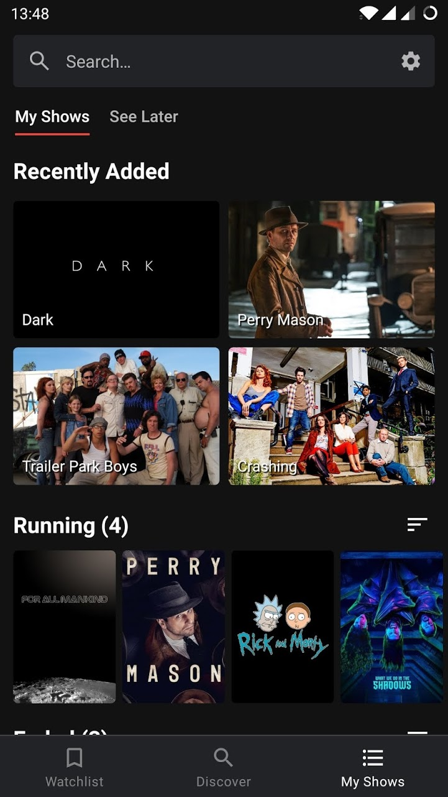

# Showly 2.0

Showly 2.0 is modern, slick, open source Android TV Shows Tracker.

Available on the Google Play Store.

 

## Screenshots

   
   
   
   
   

## Project Setup

TODO

## Issues & Contributions

Feel free to post ideas and problems as Github Issues.

## Slack

Feel free to join official Slack workspace for all things related:

[**Click to join Slack**](https://join.slack.com/t/showly2/shared_invite/enQtODE5MDYwNDMxNjIwLTQxOTA2YzBjNDFjNjU0M2Q2M2ZmMTBjNGQ2MWMxNjc0MmQyMTMxZGEyYjA0YTYzM2Y0OGIxMDU4NjBkODhkYzA)
