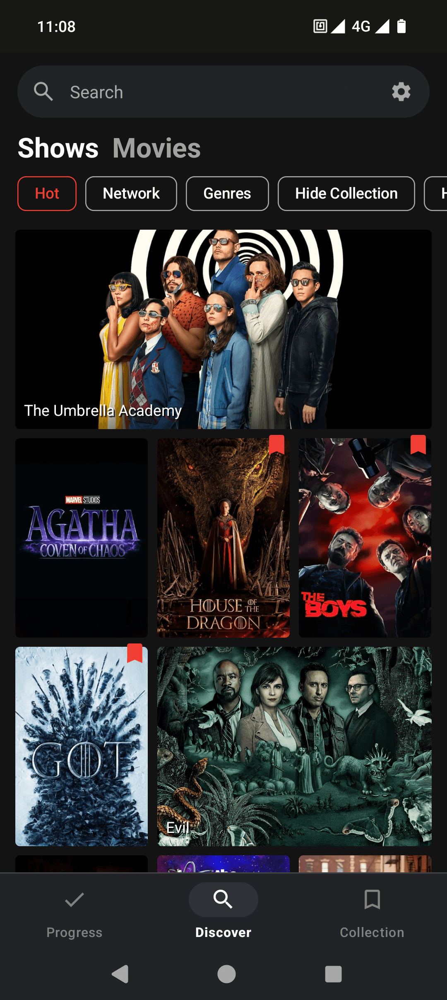
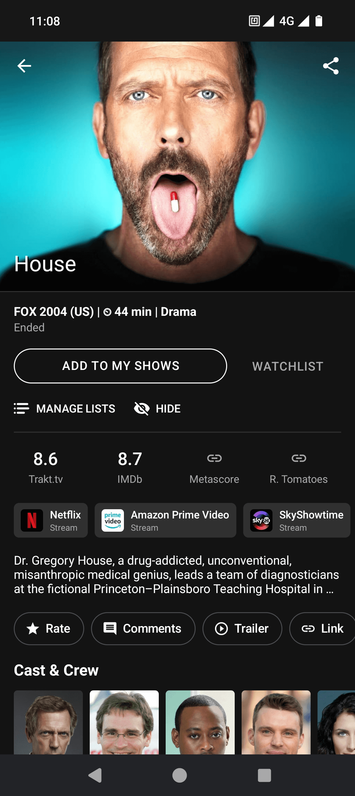
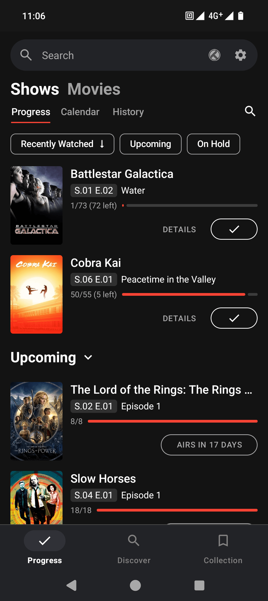
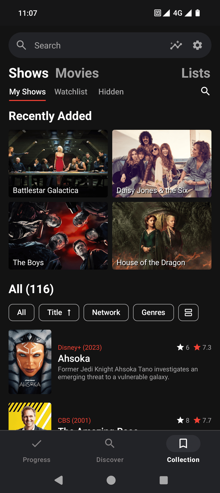

# Showly


Showly is a modern Android TV Shows Tracker.

The OSS version available in this repo is completely free of all Google services. 

<a href="https://play.google.com/store/apps/details?id=com.michaldrabik.showly2">
  
</a>

## Screenshots

<div>
   
   
   
   
</div>

## Project Setup

1. Clone repository and open project in the latest version of Android Studio.
2. Create `keystore.properties` file and put it in the `/app` folder.
3. Add following properties into `keystore.properties` file (values are not important at this moment):
```
keyAlias=github
keyPassword=github
storePassword=github
```
4. Add your [Trakt.tv](https://trakt.tv/oauth/applications), [TMDB](https://developers.themoviedb.org/3/), [OMDB](http://www.omdbapi.com) API keys as following properties into your `local.properties` file located in the root directory of the project:
```
traktClientId="your trakt client id"
traktClientSecret="your trakt client secret"
tmdbApiKey="your tmdb api key (v4)"
omdbApiKey="your omdb api key"
```
5. Rebuild and start the app.

## Issues & Contributions

Feel free to post problems with the app as Github [Issues](https://github.com/michaldrabik/showly-2.0/issues).

Features ideas should be posted as new GIthub [Discussion](https://github.com/michaldrabik/showly-2.0/discussions).

Pull requests are welcome. Remember about leaving a comment in the relevant issue if you are working on something.

## Translations

Want to help translating Showly into your native language? Spotted a mistake?<br>
Join the CrowdIn project which is used to manage translations:<br>
https://crwd.in/showly-android-app <br>

Translations status for 5 Aug 2024:


## Dev Notes

The codebase has been around for a few years now and it grew a bit rusty.
Few things surely could be adressed:

- Overall architecture should be simplified and refactored into more strict feature-based one
- Single responsibility principle is broken and should be refactored in a few places like some of the Use Cases
- Retrofit could be replaced in favor of Ktor Client
- Jetpack Compose migration (although there is no **_real_** benefit of it currently from end-user point of view)
- Add more unit tests to complete suite and increase coverage

## FAQ

**1. Can I watch/stream/download shows and movies with Showly app?**

  No, that is not possible. Showly is a progress tracking type of app - not a streaming service.


**2. I'm a user from India. I can't see any images and also encounter errors!**

  There is a known issue with TMDB API being blocked by India gov.
  For more details and a possible solution please see the thread here:
  [https://www.themoviedb.org/talk/65d226e5c433ea0187b5b958#65d2dd5128d7fe017c34e9b5](https://www.themoviedb.org/talk/65d226e5c433ea0187b5b958#65d2dd5128d7fe017c34e9b5)


**3. Show/Episode/Movie I'm looking for seems to be missing. What can I do?**

  Showly uses [Trakt.tv](https://trakt.tv) as its main data source.
  If something is missing please use "Import Show" / "Import Movie" option located at the bottom of Trakt.tv website.
  It's also possible to contact Trakt.tv support about any related issue.

## Contact

Twitter: https://twitter.com/AppShowly

Landing Page: www.showlyapp.com

Email: showlyapp@gmail.com
